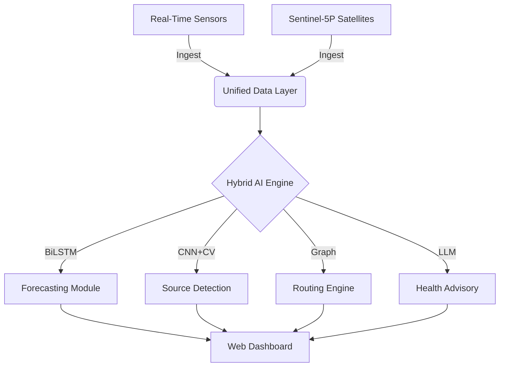

# 🌿 AURALIS: The Future of Urban Air Quality Management

<div align="center">


[](https://sih.gov.in)
[](LICENSE)
[](https://github.com/antonyjoseph2111/auralis)

**An Integrated Multi-Modal System for Air Pollution Monitoring, Forecasting, and Mitigation.**
*Empowering cities with Physics-Aware AI and Satellite Intelligence.*

[Explore the Docs](#) · [View Demo](#) · [Report Bug](#)

</div>

---

## 🚀 Overview

**Auralis** is a groundbreaking platform developed to combat the severe air pollution crisis in the Delhi-NCR region. Born out of the **Smart India Hackathon 2024**, our solution integrates cutting-edge deep learning, satellite imagery, and graph algorithms to provide a holistic approach to air quality management.

We don't just monitor pollution; we predict it, trace it to its source, and guide you through it safely.

---

## 💎 The ClearSight Ecosystem

This repository consolidates the entire Auralis ecosystem into a single unified monorepo. Explore our five core modules:

### 1. 🔮 AQI Forecasting (`clearsight-aqi-forecasting`)
*state-of-the-art Hybrid Physics-Aware BiLSTM Models*
- **72-Hour Predictions**: Highly accurate PM2.5 forecasting.
- **Physics-Informed**: Constrained by meteorological laws to prevent hallucinations.
- **Real-Time Correction**: Dynamically adjusts to live CPCB sensor data.

### 2. 🗺️ Pollution-Free Routing (`clearsight-pollution-free-routing`)
*Deep Graph Algorithms for Healthy Commutes*
- **A* Search Integration**: Custom routing engine weighing path distance against exposure.
- **Heatmap Layer**: Avoids hotspots of toxic air.
- **Graph-Based Navigation**: Optimized for pedestrians and cyclists.

### 3. 🏭 Source Identification (`clearsight-source-prediction`)
*Satellite-Based Plume Tracking*
- **Sentinel-5P Data**: Analysis of satellite imagery to detect NO2 and aerosol plumes.
- **Reverse Trajectory Modeling**: Traces pollution back to industrial or agricultural sources.
- **Visual Evidence**: Generates evidence packages for authorities.

### 4. 🏥 Health Advisory (`clearsight-health-advisory`)
*Personalized Risk Assessment*
- **Gemini AI Integration**: Generates custom health reports based on user profiles (asthma, age).
- **Activity Recommendations**: "Is it safe to jog today?"
- **Medical Context**: Connects pollution levels to potential health symptoms.

### 5. 📜 Policy Analysis (`clearsight-policy-implementation`)
*Data-Driven Decision Support*
- **Impact Assessment**: Historical analysis of policy interventions (e.g., Odd-Even rule).
- **Counterfactual Modeling**: "What if" scenarios for new regulations.
- **Station-Wise Granularity**: Detailed reports for distinct neighborhoods.

---

## 🏗️ Technical Architecture



---

## 🏆 Team Auralis

We are the proud **Winners of Smart India Hackathon 2024 (SIH25216)**.

| **Antony Joseph** | **Nate Kurian** | **Aparna Anil Nair** |
| :---: | :---: | :---: |
| 🧑‍💻 Team Leader | 🚀 Member | 🎨 Member |

| **George Tomson** | **Athul Lal SP** | **Divya Tresa Thomas** |
| :---: | :---: | :---: |
| 🔧 Member | 📊 Member | 💡 Member |

---

## 🛠️ Installation & Setup

This is a monorepo. You can run individual modules by navigating to their directories.

```bash
# Clone the master repo
git clone https://github.com/antonyjoseph2111/auralis.git
cd auralis

# Example: Run Forecasting Module
cd clearsight-aqi-forecasting
pip install -r requirements.txt
python run_pipeline.py
```

## 📜 License

Distributed under the MIT License. See `LICENSE` for more information.

---

<div align="center">
    <b>Star this repo 🌟 if you found it useful!</b>
    <br>
    Made with ❤️ by Team Auralis
</div>
