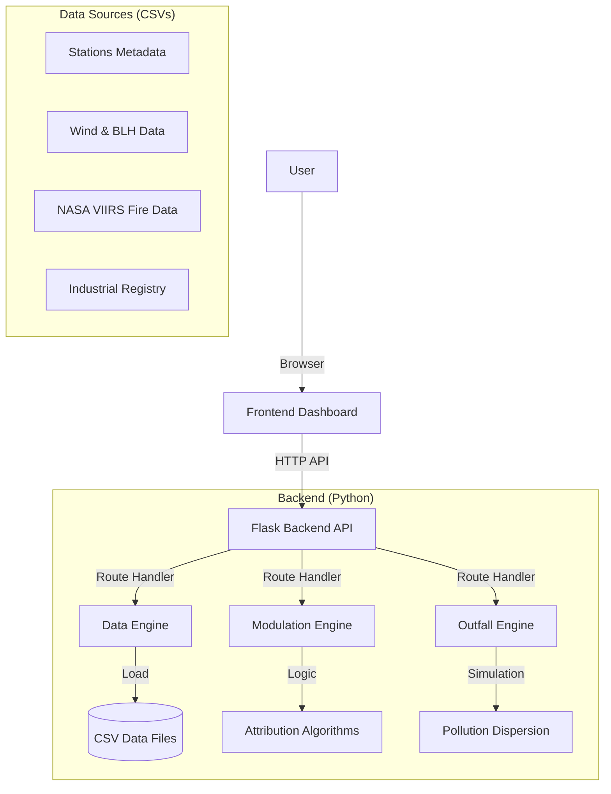

# Delhi NCR Pollution Source Attribution System - Documentation

## 1. Project Overview

The **Delhi Pollution Source Attribution System** is an AI-powered platform designed to identify and quantify the real-time sources of PM2.5 pollution in the Delhi-NCR region.

Unlike traditional regression models that often fail to distinguish between sources with similar signatures, this system uses a **Validated Prior + Anomaly Modulation** approach. It combines statistically validated seasonal baselines (priors) with real-time environmental data (anomalies) to attribute pollution to six specific sources:

1.  **Stubble Burning**: Crop residue fires from Punjab/Haryana.
2.  **Traffic**: Vehicular emissions.
3.  **Industry**: Industrial stacks and power plants.
4.  **Dust**: Road dust and construction activities.
5.  **Local Combustion**: Waste burning, cooking, and heating.
6.  **Secondary Aerosols**: Atmospheric formation and meteorological trapping.

---

## 2. System Architecture

The project follows a standard client-server architecture:



### Key Components:
-   **Dashboard (`dashboard/`)**: A responsive web interface built with HTML5, CSS3, and Vanilla JavaScript. Uses Leaflet.js for mapping and Chart.js for data visualization.
-   **API Server (`app/app.py`)**: A Flask-based REST API that serves the frontend and handles data processing requests.
-   **Modulation Engine (`src/modulation_engine.py`)**: The core "brain" of the system that calculates source percentages.
-   **Data Engine (`src/data_engine.py`)**: Handles efficient loading and querying of large CSV datasets.
-   **Outfall Engine (`src/outfall_engine.py`)**: A physics-based simulation for predicting pollution dispersion trajectories.

---

## 3. Backend Documentation

### 3.1 Core Logic: Modulation Engine (`src/modulation_engine.py`)

This file contains the proprietary attribution logic. Instead of a "black box" machine learning model, it uses a transparent, explainable algorithm.

#### Methodology:
1.  **Priors**: Starts with scientifically validated source contribution averages (from ARAI/TERI 2018 studies) for the winter season in Delhi.
    *   *Example*: Traffic ~22%, Industry ~12%, Stubble ~22%.
2.  **Baselines**: Defines "normal" levels for various pollutants and meteorological parameters (e.g., Average NO2 = 71 µg/m³, Average Stubble Season Fires = 193/day).
3.  **Modulation**: Calculates a "Modulation Factor" for each source based on real-time deviations from these baselines.
    *   **Traffic Modulation**: Derived from **NO2** levels. High NO2 relative to the baseline increases the traffic score.
    *   **Stubble Modulation**: Derived from **Fire Counts** (VIIRS data) and **Wind Direction**. Only fires upwind (NW winds) during the burning season contribute.
    *   **Industry Modulation**: Derived from **SO2** levels (a distinct industrial marker) and proximity to industrial clusters.
    *   **Dust Modulation**: Derived from **PM2.5/PM10 Ratio**. A lower ratio (< 0.3) indicates coarse dust dominance.
    *   **Secondary/Trapping**: Derived from **Boundary Layer Height (BLH)**. Low BLH (< 300m) implies severe trapping and higher secondary aerosol formation.
    *   **Local Combustion**: Derived from **CO** levels and time of day (nighttime heating/cooking peaks).
4.  **Normalization**: The modulated scores are applied to the priors, and the final result is renormalized to sum to 100%.

### 3.2 Data Management: Data Engine (`src/data_engine.py`)

Handles loading and concurrent access to static datasets.

*   **`stations_metadata.csv`**: Contains coordinates and IDs for monitoring stations.
*   **`wind_filtered.csv`**: Hourly meteorological data (Wind Speed, Direction, BLH). Supports station-specific wind data if available.
*   **`fires_combined.csv`**: Database of fire hotspots detected by NASA satellites. Supports time-lagged querying (e.g., fires from 24 hours ago that are just arriving now).
*   **`industries_cleaned.csv`**: Registry of over 2,900 industrial units with emission weights.

**Key Methods:**
*   `get_station(name)`: Find station metadata.
*   `get_wind(timestamp, lat, lon)`: Get meteorology for a specific time and location.
*   `get_fires(dt, lookback_hours)`: Retrieve relevant fire events.

### 3.3 API Server (`app/app.py`)

The Flask application exposes the following endpoints:

*   **`GET /`**: Serves the dashboard HTML.
*   **`GET /stations`**: Returns list of all monitoring stations.
*   **`GET /meteorology`**: Returns recent wind/weather data.
*   **`GET /fires`**: Returns fire hotspot data for the map (supports time-lag parameter).
*   **`GET /industries`**: Returns list of major industrial polluters.
*   **`GET /station/<id>/data`**: Returns historical pollutant readings for a specific station.
*   **`POST /attribution`**: **The Main Endpoint**. Accepts a station's readings and timestamp, runs the `modulation_engine`, and returns source percentages, explanations, and outfall predictions.
*   **`POST /outfall`**: Calculates where pollution from a specific point will drift over the next few hours.

---

## 4. Frontend Documentation

### 4.1 Dashboard Interface (`dashboard/index.html`)

A single-page application (SPA) layout containing:
*   **Header**: Time/Date picker and "Analyze" button.
*   **Map View**: Leaflet.js interactive map showing:
    *   Stations (color-coded by AQI).
    *   Fire Hotspots (circles sized by intensity).
    *   Industrial Clusters.
    *   Pollution Outfall Trajectories (animated paths).
*   **Side Panel**: Detailed breakdown for the selected station:
    *   **Attribution Chart**: Doughnut chart of source contributions.
    *   **Source Details**: List of sources with "High", "Medium", "Low" labels and text explanations (e.g., "Wind from NW bearing smoke").
    *   **Meteorology**: Current wind speed, direction, and mixing height.
    *   **Action Plan**: Targeted policy suggestions based on the dominant source.

### 4.2 Application Logic (`dashboard/app.js`)

*   **Initialization**: Loads `initMap`, fetches stations from API, and renders markers.
*   **State Management**: Tracks selected station, current timestamp, and active map layers.
*   **Attribution Workflow**:
    1.  User selects a station (click) or changes time and clicks "Analyze".
    2.  `loadStationData()` calls the backend API with the selected time.
    3.  Frontend receives source breakdown and updates the Chart.js instance.
    4.  Updates the "Source Details" list and "Action Plan" dynamically.
*   **Visualizations**:
    *   **AQI Colors**: Helper functions to determine marker colors based on CPCB AQI breakpoints.
    *   **Outfall Animation**: Renders the predicted pollution path on the map.

---

## 5. Directory Structure

```text
source_prediction/
├── app/
│   └── app.py                  # API Server entry point
├── dashboard/
│   ├── index.html              # Frontend HTML
│   ├── app.js                  # Frontend Logic
│   └── styles.css              # UI Styling
├── data/
│   ├── cleaned/                # Processed CSV datasets
│   └── raw/                    # Original raw data
├── src/
│   ├── modulation_engine.py    # Source Attribution Logic
│   ├── data_engine.py          # Data Loading Utility
│   ├── outfall_engine.py       # Dispersion Simulation
│   └── geo_utils.py            # Geometric Helper Functions
└── README.md                   # Quick Start Guide
```

## 6. How to Run

1.  **Prerequisites**: Python 3.9+, pip.
2.  **Install Dependencies**:
    ```bash
    pip install flask flask-cors pandas numpy
    ```
3.  **Start Server**:
    ```bash
    python app/app.py
    ```
4.  **Access Dashboard**:
    Open a web browser and navigate to `http://localhost:5000`.
